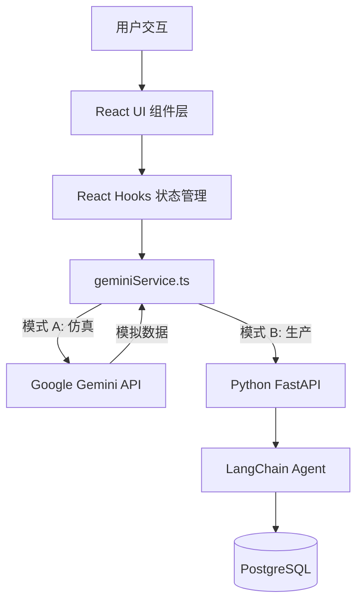

# DataNexus AI - 前端开发进展报告

## 1. 项目概述
本项目旨在开发一个基于 Web 的智能数据分析 Agent（Text-to-SQL）。用户可以通过自然语言提问，系统自动生成 SQL 查询，在数据库中执行，并将结果以可视化图表的形式展示。

前端部分采用了现代化的 React 技术栈，参考了 Google AI Studio 的界面设计风格，追求极致的用户体验、响应速度和交互美感。

## 2. 技术架构 (Architecture)

### 2.1 整体架构设计
前端采用 **单页应用 (SPA)** 架构，通过 **Service Layer (服务层)** 与外部进行交互，实现了业务逻辑与视图的分离。

### 2.2 核心技术栈
*   **核心框架**: React 18 + TypeScript (保证代码健壮性与类型安全)
*   **构建工具**: Vite (极速开发服务器与打包)
*   **UI 样式**: Tailwind CSS (原子化 CSS，实现暗黑模式和响应式布局)
*   **图标库**: Lucide React (现代化、统一的图标风格)
*   **数据可视化**: Recharts (基于 React 的组合式图表库，支持响应式)
*   **Markdown 渲染**: React Markdown (用于渲染 AI 返回的富文本格式)
*   **AI 集成**: Google GenAI SDK (前端直接集成 Gemini 能力，用于标题生成和仿真)

## 3. 已实现功能 (Features Implemented)

### 3.1 核心交互
*   **多轮对话**: 支持上下文记忆，用户可以基于上一次查询结果进行追问。
*   **智能 SQL 生成**: 将自然语言转换为标准 SQL 语句。
*   **结果可视化**:
    *   系统自动分析数据类型，智能推荐图表（柱状图、折线图、饼图）。
    *   同时提供表格视图，支持大数据量展示。
    *   SQL 代码高亮显示，方便专业用户审查。

### 3.2 架构特性
*   **双模式运行 (Dual Mode)**:
    *   **仿真模式 (Simulation Mode)**: 无需配置本地数据库，利用 LLM 的推理能力模拟数据库返回，方便前端展示、PPT 汇报或无环境下的测试。
    *   **生产模式 (Production Mode)**: 在设置中切换，连接本地 Python + PostgreSQL 后端，处理真实业务数据。
*   **国际化 (i18n)**: 完整支持中文/英文一键切换，覆盖界面所有文本及 AI 回答语言，默认中文。

### 3.3 界面与体验
*   **Google AI Studio 风格**: 深色极简主题，沉浸式体验，配色经过无障碍优化。
*   **智能会话管理**: 
    *   侧边栏记录历史会话。
    *   **自动命名**: 根据用户的第一句提问，后台静默调用小模型生成 5 个字以内的总结性标题。
*   **配置管理**: 提供完善的设置面板，管理 API Key、后端地址、数据库连接信息、自定义模型 URL (如 DeepSeek)。

## 4. 文件结构说明
*   `/src/App.tsx`: 应用主入口，处理布局、侧边栏逻辑和核心消息状态。
*   `/src/services/geminiService.ts`: 核心业务逻辑层，处理 API 请求分发（路由到 Mock 还是 Real Backend）。
*   `/src/i18n.ts`: 国际化字典，管理中英文文案。
*   `/src/components/`:
    *   `DataVisualizer.tsx`: 智能图表渲染组件，根据数据结构自动选择图表类型。
    *   `MessageBubble.tsx`: 消息气泡组件，封装了 Markdown 渲染器和结果展示容器。
    *   `SettingsModal.tsx`: 设置弹窗，处理复杂的配置表单逻辑。
