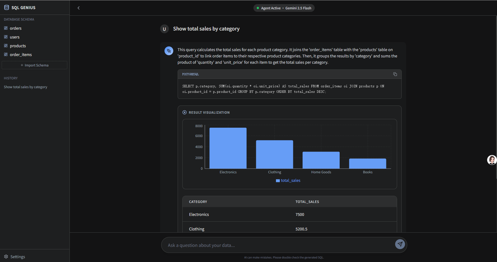

## Run Locally

**Prerequisites:**  Node.js

1. Install dependencies:
   `npm install`
2. Set the `GEMINI_API_KEY` in [.env.local](.env.local) to your Gemini API key
3. Run the app:
   `npm run dev`

用Google AI Studio试着生成了一下，效果挺好，示意图如下，打算在此基础上学习和修改：

